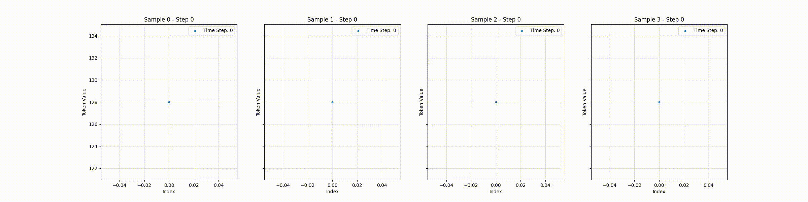
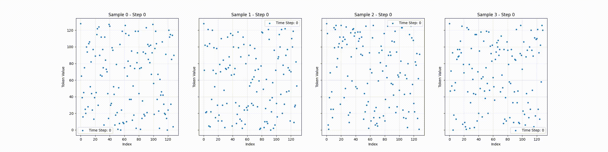
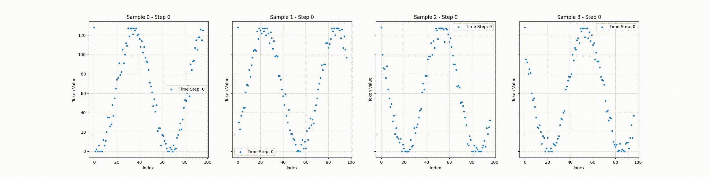

# Educational Implementation of Edit Flows

_notebook by Stephen Z. Lu_ - [X](https://x.com/stephenzlu), [Website](https://matrixmaster.me/)

This is an unofficial impmlementation of the paper **"Edit Flows: Flow Matching with Edit Operations"** by [Havasi et al.](https://arxiv.org/pdf/2506.09018).

The notebook [main.ipynb](main.ipynb) has an educational purpose and explores the modeling of discretized sine waves using a vanilla Transformer backbone. As much as possible, the notebook is self-contained, but I strongly encourage readers to read the paper for a deeper understanding of the concepts and methods used.

## Setup

To run the notebook, you will need to install the required packages inside `requirements.txt`. I used Python 3.10, but other versions of Python 3.x should work as well. To create videos of the sampling process, you will also need `ffmpeg` installed on your system.

## Samples

Here, I show some samples of sine waves generated by the model at inference time. Notice that different choices of prior distribution, target distribution, and sequence alignment lead to different results.

### Empty Prior $\rightarrow$ Sine Wave Target

### Uniform Prior $\rightarrow$ Sine Wave Target

### Low Frequency Prior $\rightarrow$ High Frequency Target

## References

📄 [1] **Discrete Flow Matching** by Itai Gat, Tal Remez, Neta Shaul, Felix Kreuk, Ricky T. Q. Chen, Gabriel Synnaeve, Yossi Adi, Yaron Lipman - [Article](https://arxiv.org/abs/2407.15595#)

📄 [2] **Edit Flows: Flow Matching with Edit Operations** by Marton Havasi, Brian Karrer, Itai Gat, Ricky T. Q. Chen - [Article](https://arxiv.org/pdf/2506.09018)

📄 [3] **Introduction to Flow Matching** by Georges Le Bellier - [Github](https://github.com/lebellig/discrete-fm/tree/master)